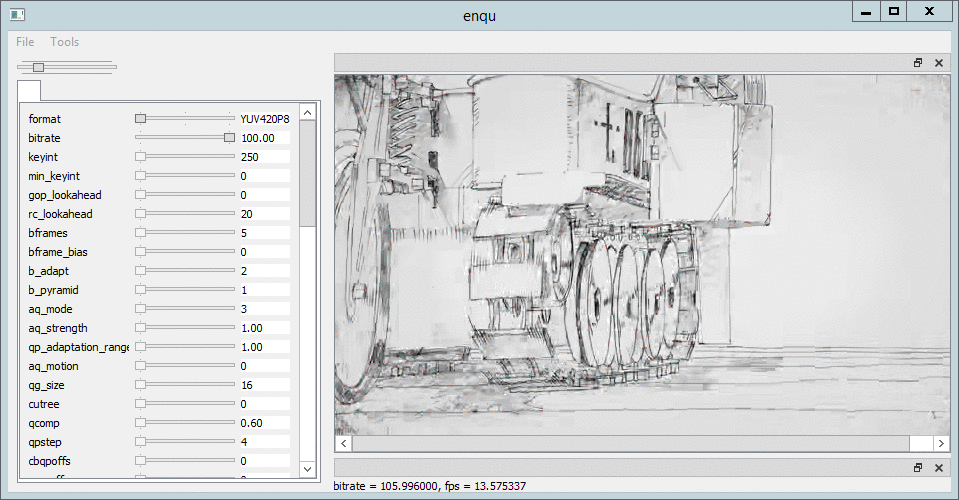

# enqu

## Dependencies

- [vapoursynth](https://github.com/vapoursynth/vapoursynth)
- [vp](https://github.com/dswned/vp)
- [x265](https://www.videolan.org/developers/x265.html)
- [qt5](https://www.qt.io/developers)

## Usage
.vpy
```
import vapoursynth as vs
core = vs.get_core()
# !!all clip copied to memory (currently)!!
clip = core.ffms2.Source(source='.mkv')[0:100]
clip = core.resize.Spline36(clip,format=vs.YUV420P10,width=640,height=360)
clip.set_output()
```

## Images


